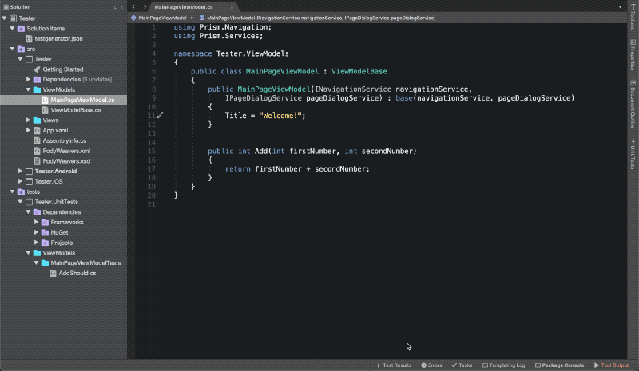

# UnitTestGenerator for Visual Studio for Mac
Visual studio for Mac extension to generate NUnit unit tests from any method

## About
This extension was created to facilitate the creation of unit tests (Currently in the context of Xamarin.Forms).
Currently, this extension only supports generation of NUnit tests and uses Moq to create mock items.

## Installation
* Download the latest mpack file from the [Releases](https://github.com/dlmcdonald/UnitTestGenerator/releases) page
* Open Extensions from the Visual Studio Menu
* Click install from file
* Browse to the downloaded file
* Restart your Visual Studio for Mac

## Usage
* Right click on a method and hit "Generate Unit Test" at the bottom of the Context Menu
  * If the method is `private`, this option will be disabled
  * If you have not used this extension before in this project, it will prompt you to select your UnitTest project. It will then generate a Solution folder and add a json config file
* A UnitTest class will be generated with the format `<MethodName>Should.cs`
  * A default `SetUp` method will also be generated
* A dialog will appear, prompting you to supply the test name
* Once you confirm the test name, the unit test method will be generated
* The following items will be generated, based on the signature of the method:
  * `expected` variable based on the return type of the method (if applicable)
  * a variable for each parameter of the method with a default value based on the type of the parameter
  * Mock objects for all constructor parameters
  * Constructor initialization
  * `result` variable assigned to the method call
  * A default assert
  * All the using statements based on the classes used in your method and constructor

